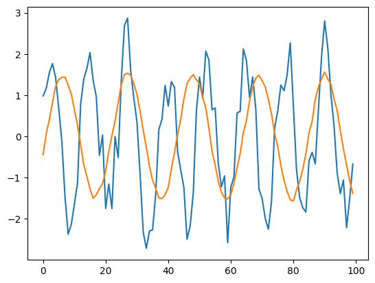

# 1d-signal-sandbox
This repository is a sandbox for running simple classification experiments on a 1D temporal signal. We can use it to "unit test" new time series architectures

The task is to classify sinusoidal data to one of two classes. We first set ground truth parameters, simulate data, then train an array of models to classify each signal.

We currently support 1D convolutions and encoder-only transformers.

## Setting up The Experiment
Choose ground truth, dataset parameters of the sine function of both classes. We use this sine function parameterization: `y=a*sin(b(x+c)) + d`. With a Gaussian noise parameter, `epsilon`
```
params = {
    "class_0": {
        'a': 2.0,
        'b': 0.5,
        'c': 1,
        'd': 0,
        'eps': 0.5
    },
    "class_1": {
        'a': 1.0,
        'b': 0.1,
        'c': 1,
        'd': 0,
        'eps': 0.05
    }
}

```

### Example:
For example, the these parameters will yield the following data:

```
params = {
    "class_0": {
        'a': 2.0,
        'b': 0.5,
        'c': 1,
        'd': 0,
        'eps': 0.5
    },
    "class_1": {
        'a': 1.5,
        'b': 0.3,
        'c': -1,
        'd': 0,
        'eps': 0.05
    }
}
```




## Running Experiment
The data parameters are just hard coded in the two experiment scripts:
- `conv_experiment.py`
- `transformer_experiment.py`

These files will
- Simulate data
- Plot two time series signals
- Train a 1D ConvNet or Transformer Encoder-only model
- Display loss curves
- Print out test accuracy

To execute the experiments, directly edit the files `conv_experiment.py` and `transformer_experiment.py` with your data parameters. Make sure `torch` is installed (IDK about version lol). Then run `python3 transformer_experiment.py` and `python3 conv_experiment.py`
